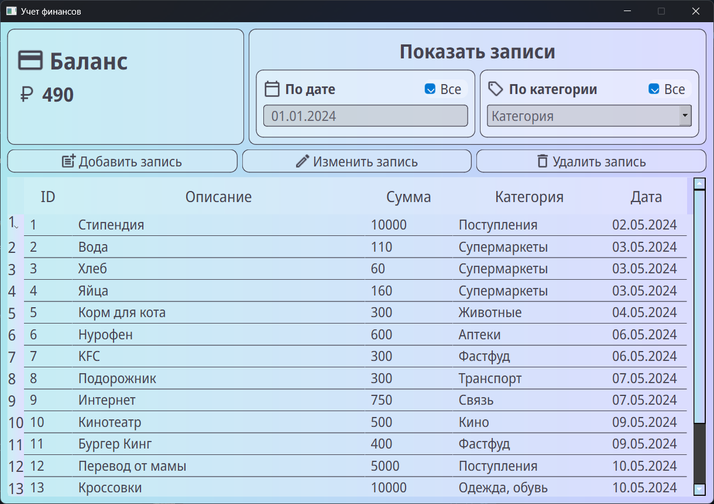

# ExpenseTracker
Приложение для контроля личных финансов - позволяет отслеживать свои траты и поступления. Реализована фильтрация данных по дате и категории, а также добавление, изменение и удаление записей.

Приложение написано на Python в соответствии с принипами ООП. Взаимодействие с базой данных SQLite, а также интерфейс реализованы с помощью библиотеки PyQt6.

